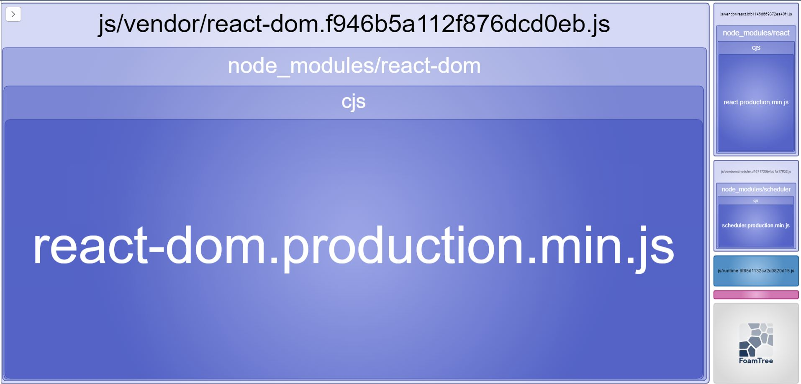
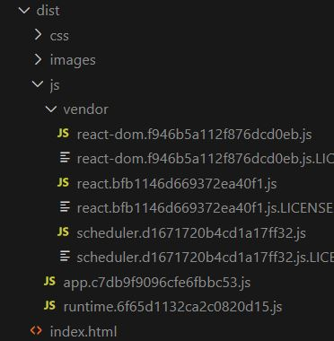
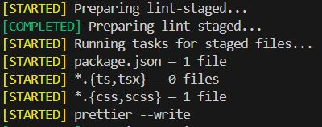

# Laboratorio de Bundling
## Webpack
El ejercicio básico sería implementar una aplicación simple que:
### Muestre un logo (por ejemplo el de lemoncode u otro que queráis). ✔️

A partir de webpack 5, ya no es necesario usar loaders de terceros para cargar imágenes, directamente podemos añadir la entrada de la extensión:

````javascript
{
  test: /\.(png|jpg)$/,
  type: 'asset/resource',
},
````
También se ha configurado el html loader por si hubieran imágenes referenciadas directamente en un < img >

````javascript
{
	test: /\.html$/,
	loader: "html-loader",
},
````

### Esté montada con Typescript. ✔️
Se ha instalado TypeScript en el proyecto y se ha añadido la configuración al preset de Babel.
````javascript
{
  "presets": [
  	"@babel/preset-env",
  	"@babel/preset-react",
  	"@babel/preset-typescript"
	]
}
````
También se ha añadido el fichero **tsconfig.json** y actualizado la extensión del punto de entrada a ts y tsx, además de resolver las extensiones y los ficheros ya existentes:
````javascript
resolve: {
	extensions: [".js", ".ts", ".tsx"],
},
entry: {
	app: "./index.tsx",
},
````
````javascript
{
	test: /\.tsx?$/,
	exclude: /node_modules/,
	loader: "babel-loader",
},
````
También hemos definido el fichero **./src/declaration.d.ts** para declarar scss como módulo y evitar errores. 
````javascript
declare module "*.scss";
````
Se han realizado otras configuraciones como un nuevo comando solo para ejecutar el chequeo de tipos, y otro comando para ejecutar el proceso de build de webpack en paralelo:
````json
"start": "run-p -l type-check:watch start:dev",
"type-check": "tsc --noEmit",
"type-check:watch": "npm run type-check -- --watch",
"start:dev": "webpack serve --config webpack.dev.js",
````
También hemos reducido  la verbosidad de la salida de errores de webpack:
````javascript
devMiddleware: { stats: "errors-only" },
````
Y generado los ficheros map para poder hacer debugging:
````javascript
devtool: "eval-source-map",
````
### Muestre el texto "hola mundo" estilado con SASS.​ ✔️

Hemos instalado sass y su loader, agregamos una nueva entrada (scss).
````javascript
{
  test: /\.scss$/,
  exclude: /node_modules/,
  use: ["style-loader", "css-loader", "sass-loader"],
},
````
## Opcional
### Mostrar un hola mundo desarrollado con React. ✔️

Como se ha podido observar en los ejemplos anteriores, se ha instalado React y se ha adaptado la configuración de tipos en webpack. También se ha añadido el preset necesario a la configuración de **.babelrc**
### Tener una versión de build de producción. ✔️
Se ha dividido la configuración de webpack en tres ficheros: 
- [webpack.common.js](./webpack.common.js)
- [webpack.dev.js](./webpack.dev.js)
- [webpack.prod.js](./webpack.prod.js)

Haciendo uso de la herramienta llamada **webpack-merge** se han configurado los ficheros haciendo uso de {merge}.

Los scripts del package.json quedan por tanto así: 
````json
"scripts": {
		"start": "run-p -l type-check:watch start:dev",
		"type-check": "tsc --noEmit",
		"type-check:watch": "npm run type-check -- --watch",
		"start:dev": "webpack serve --config webpack.dev.js",
		"start:prod": "webpack serve --config webpack.prod.js",
		"build:dev": "webpack --config webpack.dev.js",
		"build:prod": "webpack --config webpack.prod.js",
	},
````
### Tener variables de entorno para diferentes entornos (desarrollo y producción). ✔️
Hemos instalado **dotenv-webpack** y creado los ficheros **dev.env** **prod.env** para configurarlos en su configuración de webpack correspondiente, como por ejemplo: 
````javascript
plugins: [
   new Dotenv({
     path: './dev.env',
   }),
 ],
````
Para hacer la prueba imprimimos la variable de entorno por pantalla en un componente de React: 
````html
<p>{process.env.MODE}</p>
````
### Tener una forma de medir cuanto ocupa cada librería y nuestro código en el bundle.​ ✔️
Hemos instalado el plugin **webpack-bundle-analyzer** y creado una nueva configuración de **./webpack.perf.js**:
````javascript
import { merge } from "webpack-merge";
import prod from "./webpack.prod.js";
import { BundleAnalyzerPlugin } from "webpack-bundle-analyzer";

export default merge(prod, {
  plugins: [new BundleAnalyzerPlugin()],
});
````
Añadimos el siguiente script en **pacjage.json** para ejecutarlo:
````json
"build:perf": "npm run type-check && webpack --config webpack.perf.js"
````


Hemos añadido la siguiente configuración en el **webpack.prod.js** para crear una carpeta donde cada vendor tenga su propio bundle:
````javascript
optimization: {
		runtimeChunk: "single",
		splitChunks: {
			cacheGroups: {
				vendor: {
					chunks: "all",
					name: (module) => {
						const packageName = module.context.match(
							/[\\/]node_modules[\\/](.*?)([\\/]|$)/
						)?.[1];
						return packageName ? `vendor/${packageName.replace("@", "")}` : null;
					},
					test: /[\\/]node_modules[\\/]/,
					enforce: true,
				},
			},
		},
	},
````


## Bonus Point
### Configuración de Husky 🐶
Se ha instalado Husky para formatear el texto {ts,tsx} o {css,scss} con Prettier cuando se realice un precommit.

Para ello se han añadido los ficheros **.prettierrc.json** **.prettierignore**.

En el package.json se ha añadido la configuración para lint-staged: 
````json
"lint-staged": {
    "*.{ts,tsx}": [
      "prettier --write"
    ],
    "*.{css,scss}": [
      "prettier --write"
    ]
  }
````
Y la configuración en el **./husky/pre-commit**
````
#!/usr/bin/env sh
. "$(dirname -- "$0")/_/husky.sh"

npx lint-staged
````
